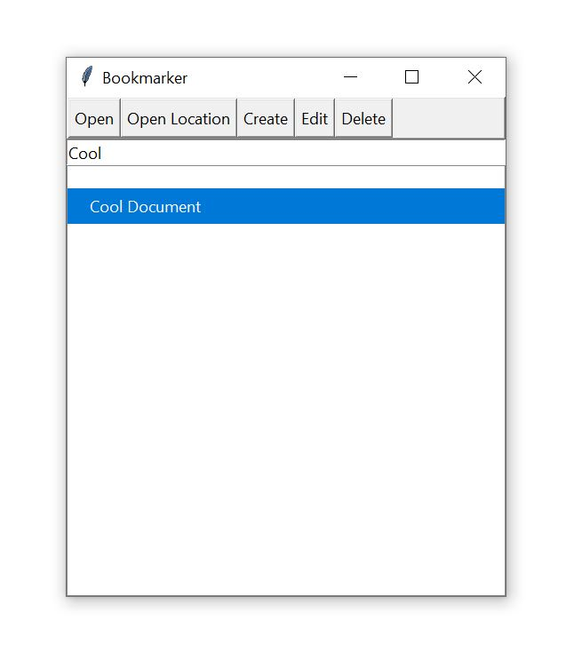
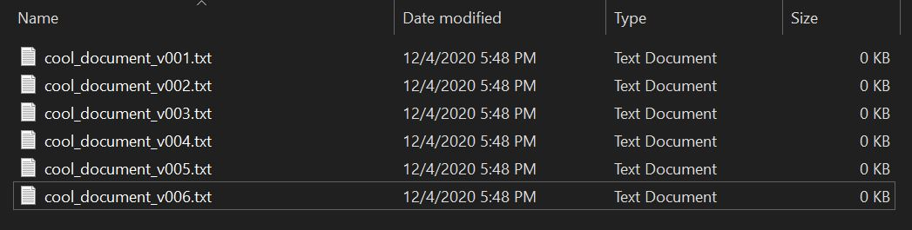
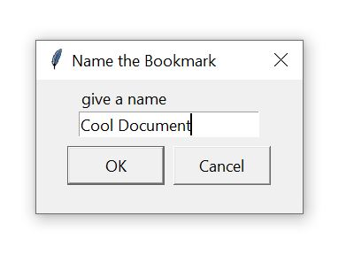

# bookmarker

Bookmark a file, open the latest version of it or its location.

## Open Latest Version

Bookmarker will look for the latest version of the bookmarked file when opening. It assumes something like `filename_v001.txt` for naming convention

## Give a readable name

If your doc has an annoying name, it helps to give your bookmark one that feels intuitive.

